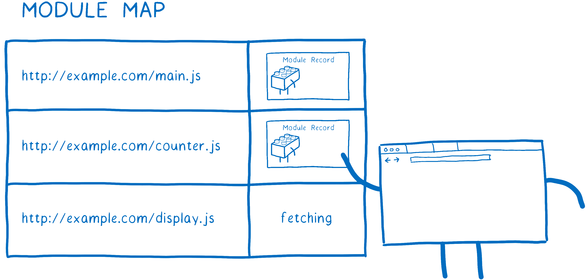

# Atlas

## Key Terms

<dl>
<dt id="apm">application performance management (APM)</dt>
<dd>

the monitoring and management of performance and availability of software
applications — strives to detect and diagnose complex application performance
problems to maintain an expected level of service

</dd>
<dt id="import-maps">

[import maps](https://wicg.github.io/import-maps)

</dt>
<dd>

allow web pages to control the behavior of JavaScript imports

</dd>
<dt id="module-map">

[module map](https://html.spec.whatwg.org/multipage/webappapis.html#module-map)

</dt>
<dd>

A **module map** is a [map](https://infra.spec.whatwg.org/#ordered-map) of
[URL records](https://url.spec.whatwg.org/#concept-url) to values that are
either a [module script](https://html.spec.whatwg.org#module-script), null (used
to represent failed fetches), or a placeholder value "`fetching`".
[Module maps](https://html.spec.whatwg.org#module-map) are used to ensure that
imported JavaScript modules are only fetched, parsed, and evaluated once per
[`Document`](https://html.spec.whatwg.org/dom.html#document) or
[worker](https://html.spec.whatwg.org/workers.html#workers)
([[HTML]](#refs-html), section 8.1.3.8).

 _A cartoon module map._
[1](#note-1)

</dd>

<dt id="monkey-patch">monkey patch</dt>
<dd>

a way for a program to extend or modify a module or class while the program is
running locally (affecting only the running instance of the program)

</dd>
</dl>

## References

<dl>
<dt id="refs-html" name="refs-html">[HTML]</dt>
<dd><cite>

[HTML Language Specification]</cite>. WHATWG.</dd>

<dt id="refs-javascript" name="refs-javascript">[JAVASCRIPT]</dt>
<dd><cite

[ECMAScript Language Specification]</cite>. Ecma International.</dd>

</dl>

[html language specification]: https://html.spec.whatwg.org/ "HTML Standard"
[ecmascript language specification]:
  https://tc39.es/ecma262/
  "JavaScript Standard"

---

<!-- Foootnotes -->

1. Cartoon module map illustration from [ES
   modules: A cartoon deep-dive] by [Lin Clark](https://twitter.com/linclark)
   licensed under [CC BY-SA 3.0].

[es modules: a cartoon deep-dive]:
  https://hacks.mozilla.org/2018/03/es-modules-a-cartoon-deep-dive/
  "ES modules: A cartoon deep-dive"

---

<!-- Footer -->

![CC logo icon] ![CC BY icon] ![CC SA icon] Portions of this document are
reproduced from work created and [shared by Mozilla][moz-policies] and used
according to terms described in [CC BY-SA 3.0].

![CC logo icon] ![CC BY icon] Except as otherwise noted, this content is
published under [CC BY 4.0].

[cc by icon]: ./img/cc-by_icon.svg "Attribution icon"
[cc logo icon]: ./img/cc_icon.svg "Creative Commons icon"
[cc sa icon]: ./img/cc-sa_icon.svg "ShareAlike icon"
[cc by-sa 3.0]:
  https://creativecommons.org/licenses/by-sa/3.0/
  "Creative Commons Attribution-ShareAlike 3.0 Unported license (CC BY-SA 3.0)"
[cc by 4.0]:
  https://creativecommons.org/licenses/by/4.0/
  "Creative Commons Attribution 4.0 International license (CC BY 4.0)"
[moz-policies]:
  https://www.mozilla.org/en-US/foundation/licensing/
  "Mozilla Licensing Policies"
